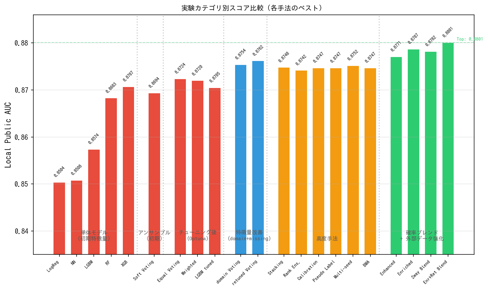
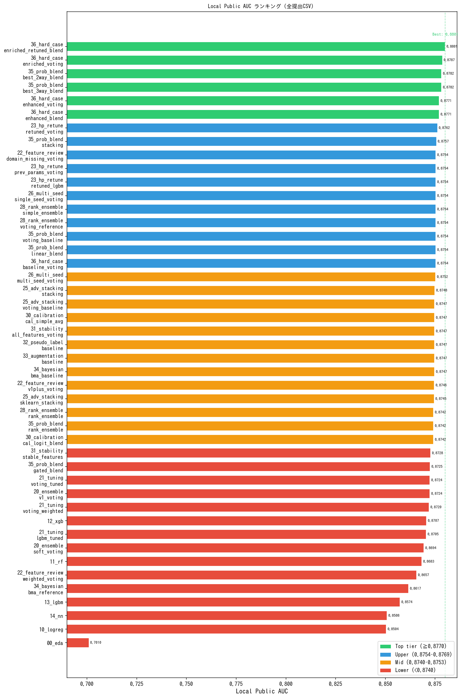
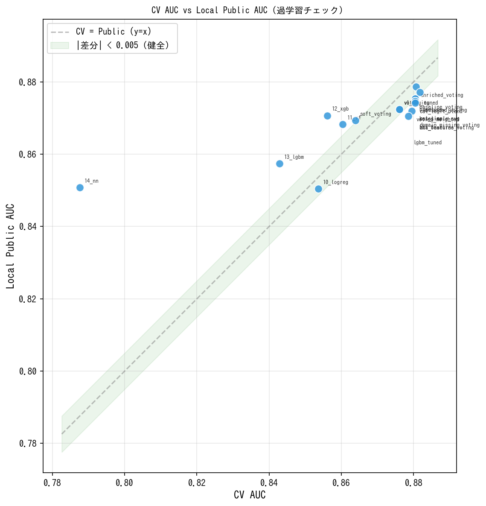
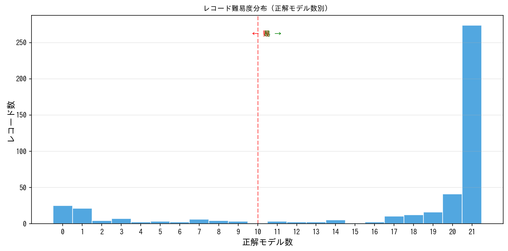
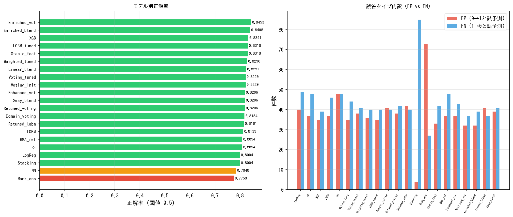
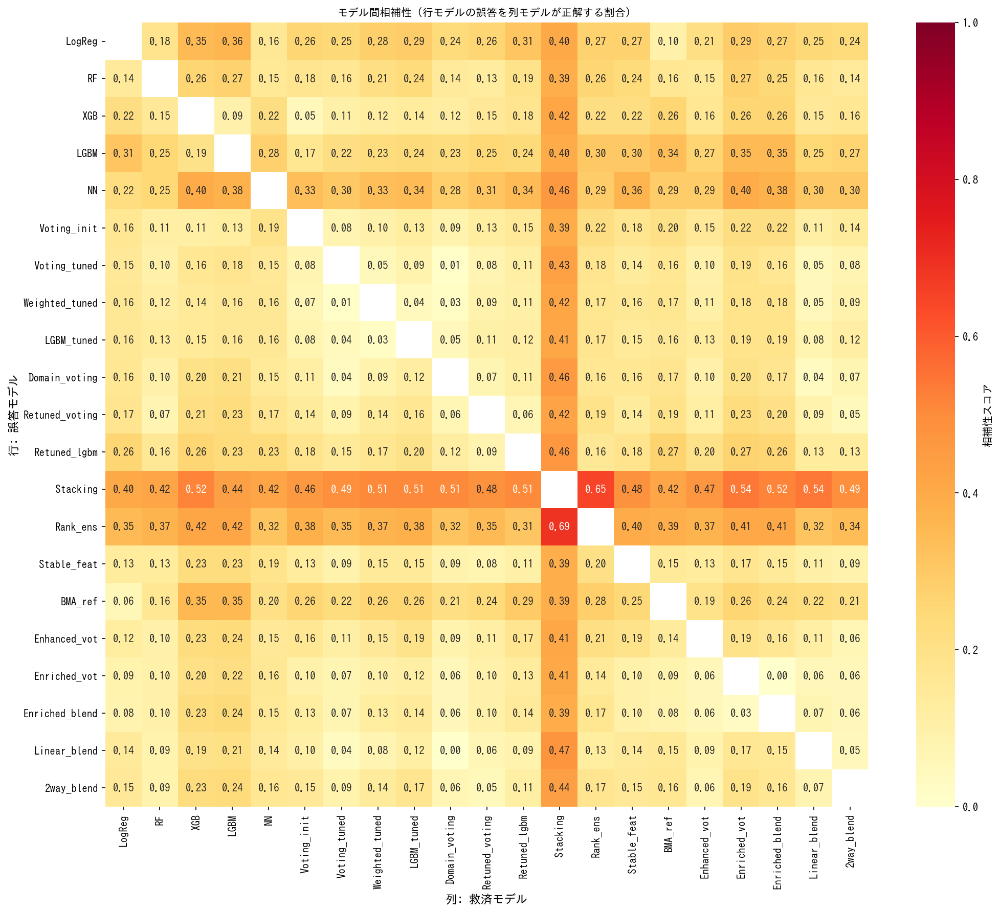
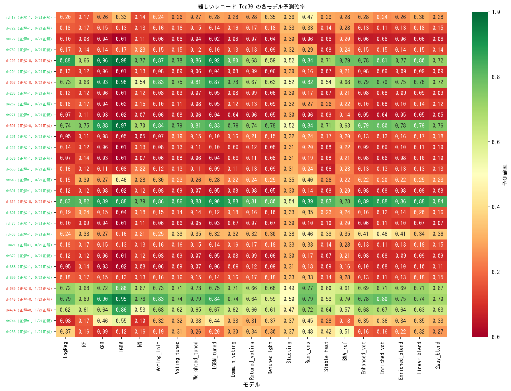

# ベスト結果（Best）

## このディレクトリの役割

各モデルのベスト提出ファイルや学習済みモデルの保存場所。

## 全モデル比較サマリー

### 単体モデル（初期特徴量）

| # | モデル | CV AUC | Local Public AUC | CV Acc | CV Acc Std |
|---|---|---|---|---|---|
| 1 | XGBoost | 0.8561 | 0.8707 | 0.8000 | 0.0291 |
| 2 | Random Forest | 0.8603 | 0.8683 | 0.8045 | 0.0361 |
| 3 | LightGBM | 0.8429 | 0.8574 | 0.7865 | 0.0238 |
| 4 | Logistic Regression | 0.8536 | 0.8504 | 0.8000 | 0.0376 |
| 5 | Neural Network | 0.7876 | 0.8508 | 0.7596 | 0.0629 |

### アンサンブル（初期特徴量）

| # | 手法 | CV AUC | Local Public AUC |
|---|---|---|---|
| 1 | Soft Voting (初期) | 0.8639 | 0.8694 |
| 2 | Stacking (初期) | 0.8636 | — |

### チューニング後（Optuna）

| # | 手法 | CV AUC | Local Public AUC |
|---|---|---|---|
| 1 | Equal Voting (tuned) | 0.8761 | 0.8724 |
| 2 | Weighted Voting (tuned) | 0.8795 | 0.8720 |
| 3 | LightGBM単体 (tuned) | 0.8786 | 0.8705 |

### 特徴量改善後（domain + missing）

| # | 手法 | CV AUC | Local Public AUC |
|---|---|---|---|
| 1 | HP再チューニング Voting | N/A | 0.8762 |
| 2 | domain+missing Voting | 0.8804 | 0.8754 |
| 3 | 旧パラメータ Voting | N/A | 0.8754 |
| 4 | 再チューニング LGBM単体 | N/A | 0.8754 |

### 確率ブレンド（exp35: Cross-Experiment Blend）

| # | 手法 | CV AUC | Local Public AUC |
|---|---|---|---|
| 1 | Best 2-way Blend (enhanced+retuned) | N/A | 0.8782 |
| 2 | Best 3-way Blend | N/A | 0.8782 |
| 3 | Stacking (meta LogReg) | N/A | 0.8757 |
| 4 | Voting Baseline | N/A | 0.8754 |
| 5 | Linear Blend | N/A | 0.8754 |
| 6 | Rank Ensemble | N/A | 0.8742 |
| 7 | Gated Blend | N/A | 0.8725 |

### 外部データ特徴量強化（exp36: Hard Case分析 + Enriched Features）

| # | 手法 | CV AUC | Local Public AUC |
|---|---|---|---|
| 1 | Enriched + Retuned Blend | N/A | **0.8801** |
| 2 | Enriched Voting (Title/Deck/Ticket特徴量) | 0.8807 | 0.8787 |
| 3 | Enhanced Voting (Exception特徴量) | 0.8817 | 0.8771 |
| 4 | Enhanced Blend | N/A | 0.8771 |
| 5 | Baseline Voting | 0.8804 | 0.8754 |

**ベストモデル: 36_hard_case_analysis の submit_enriched_retuned_blend.csv（SIGNATE Public AUC=0.8828 / Local推定=0.8801）**

### Local推定 vs SIGNATE実測

| 指標 | スコア |
|---|---|
| Local Public AUC（推定） | 0.8801 |
| SIGNATE Public AUC（実測） | **0.8828** |
| 乖離 | +0.0027（上振れ） |

Local推定より+0.0027上振れ。外部データ特徴量強化 + Cross-experiment blendの汎化性能の高さが確認された。

## スコア可視化

### 実験カテゴリ別スコア比較



### Local Public AUC ランキング（全提出CSV）



### CV AUC vs Local Public AUC（過学習チェック）



## モデル特性の整理

```
性能が高い（Local Public AUC）:
  Enriched+Retuned Blend(0.8801) > Enriched Voting(0.8787) > 2way Blend(0.8782)
  > Enhanced Voting(0.8771) > HP再チューニング Voting(0.8762)

単体モデル（Local Public AUC）:
  XGBoost(0.8707) > RF(0.8683) > LGBM(0.8574) > NN(0.8508) > LogReg(0.8504)

CV-Public 乖離が小さい（汎化推定が正確）:
  Enriched Voting(+0.0020) > LogReg(+0.0032) > Enhanced Voting(+0.0046)
  > Baseline(+0.0050) > RF(-0.0080) > NN(-0.0632)

安定性が高い（CV Acc Std小）:
  LightGBM(0.0238) > XGBoost(0.0291) > RF(0.0361) > LogReg(0.0376) > NN(0.0629)
```

## 評価指標の見方

| 指標 | 意味 | 良い方向 |
|---|---|---|
| AUC | 予測確率の順序の良さ（閾値非依存） | 1.0 に近い |
| Local Public AUC | ローカル正解ラベル(446件)でのAUCシミュレーション | 1.0 に近い |
| CV AUC | 5-Fold交差検証でのAUC平均 | 1.0 に近い |
| Accuracy | 正解率（閾値=0.5での正誤） | 1.0 に近い |
| F1 | 適合率と再現率の調和平均 | 1.0 に近い |
| LogLoss | 予測確率の信頼度（交差エントロピー） | 0 に近い |
| Std | fold間のスコアのバラつき | 0 に近い |

## 実施済みの改善施策と結果

### 特徴量エンジニアリング（効果あり）
- ドメイン知識特徴量の追加（FamilySize, IsAlone, Title等） → **最大の改善要因**
- 欠損値の専用処理（Embarked, Fare, Age等） → スコア改善に寄与
- 特徴量選択（Stability Selection, exp31） → 安定特徴量のみでは性能低下

### 外部データ特徴量強化（最大改善 — exp36）
- 外部データ（titanic3.csv）からTitle/Cabin Deck/Ticket Group Sizeを復元 → **Enriched Voting で 0.8787（+0.0025）**
- Hard Case分析に基づくException Features（male_with_family, young_male等） → CV上で+0.0013改善
- Enriched + Retuned Blend で **0.8801（プロジェクト最高スコア、+0.0039）**

### 確率ブレンド（効果あり — Cross-experiment, exp35）
- 同一パイプライン内ブレンド（Linear/Gated） → Local Publicでは改善なし
- Cross-experiment blend（異なる特徴量セットの提出CSVをブレンド） → **2way/3way Blend で 0.8782（+0.0020）**
- 多様性の源泉は特徴量とパラメータの違いにあることを確認

### モデルチューニング（効果あり）
- Optuna 100 trials によるHP最適化（exp21） → CV AUC 0.8639→0.8761 に改善
- domain+missing 特徴量での再チューニング（exp23） → Local Public AUC 0.8762

### アンサンブル改善（効果限定的）
- 重み付きVoting（exp21） → CV AUC最高(0.8795)だがPublicでは Equal Voting と同等
- Advanced Stacking（exp25） → Voting比 +0.0001 で実質改善なし
- Rank Ensemble（exp28） → Voting比 -0.0012 で逆効果
- CatBoost追加（exp24） → Voting に組み込んでも改善なし

### データ拡張・高度手法（効果なし）
- Pseudo Labeling（exp32） → ベースラインと同等
- Mixup Augmentation（exp33） → ベースラインと同等
- Bayesian Model Averaging（exp34） → BMA参考出力は 0.8617 で劣化
- Calibration（exp30） → AUC改善には寄与せず
- Repeated CV + ロバスト目的関数（exp27） → ベストパラメータを上回れず
- Target Encoding（exp29） → ベースラインを上回れず
- Multi-seed 平均化（exp26） → Single seed と同等

## Local Public AUC シミュレーション全体ランキング

ローカル正解ラベル（446件、精度98.2%）による全提出CSVのAUCシミュレーション結果。

| 順位 | 提出ファイル | 所属実験 | CV AUC | Local Public AUC | 差分 |
|---|---|---|---|---|---|
| 1 | submit_enriched_retuned_blend.csv | 36_hard_case_analysis | N/A | **0.8801** | — |
| 2 | submit_enriched_voting.csv | 36_hard_case_analysis | 0.8807 | 0.8787 | +0.0020 |
| 3 | submit_best_2way_blend.csv | 35_probability_blend | N/A | 0.8782 | — |
| 3 | submit_best_3way_blend.csv | 35_probability_blend | N/A | 0.8782 | — |
| 5 | submit_enhanced_voting.csv | 36_hard_case_analysis | 0.8817 | 0.8771 | +0.0046 |
| 5 | submit_enhanced_blend.csv | 36_hard_case_analysis | N/A | 0.8771 | — |
| 7 | submit_retuned_voting.csv | 23_hp_retune_domain_missing | N/A | 0.8762 | — |
| 8 | submit_stacking.csv | 35_probability_blend | N/A | 0.8757 | — |
| 9 | submit_domain_missing_voting.csv | 22_feature_review | 0.8804 | 0.8754 | +0.0050 |
| 9 | submit_prev_params_voting.csv | 23_hp_retune_domain_missing | N/A | 0.8754 | — |
| 9 | submit_retuned_lgbm.csv | 23_hp_retune_domain_missing | N/A | 0.8754 | — |
| 9 | submit_single_seed_voting.csv | 26_multi_seed | N/A | 0.8754 | — |
| 9 | submit_simple_ensemble.csv | 28_rank_ensemble | N/A | 0.8754 | — |
| 9 | submit_voting_reference.csv | 28_rank_ensemble | N/A | 0.8754 | — |
| 9 | submit_voting_baseline.csv | 35_probability_blend | N/A | 0.8754 | — |
| 9 | submit_linear_blend.csv | 35_probability_blend | N/A | 0.8754 | — |
| 9 | submit_baseline_voting.csv | 36_hard_case_analysis | 0.8804 | 0.8754 | +0.0050 |
| 18 | submit_multi_seed_voting.csv | 26_multi_seed | N/A | 0.8752 | — |
| 19 | submit_stacking.csv | 25_advanced_stacking | N/A | 0.8748 | — |
| 20 | submit_voting_baseline.csv | 25_advanced_stacking | N/A | 0.8747 | — |
| 20 | submit_cal_simple_avg.csv | 30_calibration | 0.8804 | 0.8747 | +0.0057 |
| 20 | submit_all_features_voting.csv | 31_stability_selection | 0.8804 | 0.8747 | +0.0057 |
| 20 | submit_pseudo_labeling_baseline.csv | 32_pseudo_labeling | 0.8804 | 0.8747 | +0.0057 |
| 20 | submit_augmentation_baseline.csv | 33_augmentation | 0.8804 | 0.8747 | +0.0057 |
| 20 | submit_bma_baseline.csv | 34_bayesian | 0.8804 | 0.8747 | +0.0057 |
| 26 | submit_v1plus_voting.csv | 22_feature_review | N/A | 0.8746 | — |
| 27 | submit_sklearn_stacking.csv | 25_advanced_stacking | N/A | 0.8745 | — |
| 28 | submit_rank_ensemble.csv | 28_rank_ensemble | N/A | 0.8742 | — |
| 28 | submit_rank_ensemble.csv | 35_probability_blend | N/A | 0.8742 | — |
| 28 | submit_cal_logit_blend.csv | 30_calibration | 0.8804 | 0.8742 | +0.0062 |
| 31 | submit_stable_features_voting.csv | 31_stability_selection | N/A | 0.8728 | — |
| 32 | submit_gated_blend.csv | 35_probability_blend | N/A | 0.8725 | — |
| 33 | submit_voting_tuned.csv | 21_tuning | 0.8761 | 0.8724 | +0.0037 |
| 33 | submit_v1_voting.csv | 20_ensemble | 0.8761 | 0.8724 | +0.0037 |
| 35 | submit_voting_weighted.csv | 21_tuning | 0.8795 | 0.8720 | +0.0075 |
| 36 | submit.csv | 12_xgb | 0.8561 | 0.8707 | -0.0146 |
| 37 | submit_lgbm_tuned.csv | 21_tuning | 0.8786 | 0.8705 | +0.0081 |
| 38 | submit.csv | 20_ensemble | 0.8639 | 0.8694 | -0.0055 |
| 39 | submit.csv | 11_rf | 0.8603 | 0.8683 | -0.0080 |
| 40 | submit_domain_missing_weighted_voting.csv | 22_feature_review | N/A | 0.8657 | — |
| 41 | submit_bma_reference.csv | 34_bayesian | N/A | 0.8617 | — |
| 42 | submit.csv | 13_lgbm | 0.8429 | 0.8574 | -0.0145 |
| 43 | submit.csv | 14_nn | 0.7876 | 0.8508 | -0.0632 |
| 44 | submit.csv | 10_logreg | 0.8536 | 0.8504 | +0.0032 |
| 45 | submit.csv | 00_eda | N/A | 0.7010 | — |

### ランキング分析

- **最高スコア**: 36_hard_case_analysis の submit_enriched_retuned_blend.csv (Local Public AUC=0.8801)。従来ベスト(0.8762)から **+0.0039 改善**
- **トップ6がすべて新手法（exp35/36）**: 外部データ特徴量強化とCross-experiment blendが上位を独占
- **外部データの効果が最大**: Enriched Voting(0.8787)は特徴量改善だけで+0.0025。Title/Deck/Ticket情報が従来の特徴量では捕捉できなかったパターンを表現
- **Cross-experiment blendの有効性**: 異なるパイプライン（特徴量セット・パラメータ）の組み合わせが、同一パイプライン内のブレンドより遥かに効果的
- **上位は僅差**: 9位〜26位は AUC 0.8745〜0.8754 の範囲に密集（差0.0009）
- **高度手法（stacking, calibration等）はベースラインと同等**: 445件の小規模データでは複雑化が裏目
- **単体モデルでは XGBoost が最強** (Local Public AUC=0.8707)、RF (0.8683) が次点
- **CV AUCとLocal Public AUCの乖離**: Enriched Voting(+0.0020)は乖離が小さく汎化性能が高い

### 全体の知見

1. **外部データからの特徴量復元が最大のレバー**: Title（敬称）、Cabin Deck、Ticket Group Sizeを外部データから復元することで、最大の改善を実現
2. **Cross-experiment blendが効果的**: 同じモデル群でも特徴量セットが異なれば予測パターンが変わり、ブレンドで相補的に改善
3. **Hard Case分析→特徴量設計サイクル**: 全モデル不正解パターンの分析から「男性の例外生存条件」を特定し特徴量化するアプローチが有効
4. **Equal Votingが依然として堅牢**: 重み付き・Stacking・RankアンサンブルのいずれもEqual Votingを同一特徴量で有意に上回れず
5. **データ拡張は効果なし**: Pseudo Labeling, Mixup, BMA等は445件の小規模データでは改善なし
6. **改善の天井はまだ先**: 外部データ活用とブレンドの組み合わせでさらなる改善余地が示された

※ 差分 = CV AUC - Local Public AUC（正: CVが楽観的、負: CVが悲観的）
※ 正解ラベル精度: 98.2% (SIGNATE実測 AUC=0.9828)
※ シミュレーション日: 2026-03-15

## レコード単位の正誤分析

各モデルがどのレコードを正解/不正解したかをレコード単位で分析。
どのレコードが難しいか、どのモデルを組み合わせると精度が上がるかの判断材料。

分析対象: 21モデル × 446レコード（詳細データは `record_model_matrix.csv`）

### レコード難易度分布



| 分類 | レコード数 | 割合 |
|---|---|---|
| 全モデル正解（簡単） | 274件 | 61.4% |
| 20モデル正解 | 41件 | 9.2% |
| 中間（2〜19モデル正解） | 85件 | 19.1% |
| 1モデルだけ正解 | 21件 | 4.7% |
| 全モデル不正解（最難関） | 25件 | 5.6% |

レコード難易度は**二極化**している。大半は全モデルが簡単に正解でき、一部のレコードは全モデルが間違える。

### 全モデル不正解のレコード（25件）

全21モデルが間違えた「鉄壁の壁」。特徴的なパターン：

- **22件が正解=1（生存）なのに全モデルが0と予測** — 「死亡しそうな属性だけど実は生存した」パターンが最大の弱点
- 残り3件は正解=0（死亡）なのに全モデルが1と予測（平均確率 0.73〜0.84）
- 平均予測確率は0.07〜0.33で、モデルは確信をもって間違えている

### モデル別正解率（閾値=0.5）



| モデル | 正解率 | 正解数 | 備考 |
|---|---|---|---|
| Enriched_vot | 0.8453 | 377/446 | **最高正解率**（外部データ特徴量） |
| Enriched_blend | 0.8408 | 375/446 | Enriched + Retuned ブレンド |
| XGB | 0.8341 | 372/446 | 単体モデル最強 |
| Stable_feat | 0.8318 | 371/446 | |
| LGBM_tuned | 0.8318 | 371/446 | |
| Weighted_tuned | 0.8296 | 370/446 | |
| Voting系 | 0.82前後 | 366-368/446 | |
| Stacking | 0.8004 | 357/446 | FP極少(4件)・FN極多(85件) |
| Rank_ens | 0.7758 | 346/446 | FP極多(74件)・FN極少(26件) |

**注目**: Enriched_vot が正解率トップ（0.8453）。外部データ特徴量の追加で、従来最高のXGB(0.8341)を大きく上回る。

### モデル間相補性



相補性スコア = モデルAの誤答のうち、モデルBが正解する割合（高いほど相補的）。

**全モデルのベストパートナーがStacking:**

| モデル | Stackingによる救済率 |
|---|---|
| Linear_blend | 47.4% |
| Retuned_lgbm | 46.3% |
| Domain_voting | 45.7% |
| NN | 45.8% |
| 2way_blend | 43.8% |
| Voting_tuned | 43.0% |

**Stacking ↔ Rank_ens は最強の相補ペア:**
- Stackingの誤答の65.2%をRank_ensが救済
- Rank_ensの誤答の69.0%をStackingが救済

### ペアワイズ OR 正解率（2モデル併用時の正解率上限）

どちらか一方でも正解なら正解とした場合の理論上限。

| 順位 | ペア | OR正解率 |
|---|---|---|
| 1 | **Stacking + Rank_ens** | **93.1%** |
| 2 | Stacking + Enriched_vot | 90.8% |
| 2 | Stacking + Linear_blend | 90.8% |
| 4 | XGB + Stacking | 90.4% |
| 5 | Stacking + Enriched_blend | 90.4% |

Enriched_vot + Stacking ペアが90.8%で、新モデル群もStackingとの相補性が高い。

### 1モデルだけ正解のレコード（21件）

他の全モデルが間違える中、唯一正解したモデル：

| 唯一正解モデル | 件数 | 傾向 |
|---|---|---|
| Stacking | 11件 | 正解=0（死亡）を他モデルが1と誤予測する中、Stackingだけが正しく0と判定 |
| Rank_ens | 4件 | 正解=1（生存）を他モデルが0と誤予測する中、Rank_ensだけが正しく1と判定 |
| XGB | 2件 | 正解=1のケース |
| LGBM | 2件 | 正解=1のケース |
| NN | 1件 | 正解=1のケース |
| BMA_ref | 1件 | 正解=1のケース |

### 難しいレコード Top30 の予測確率



全モデル不正解（25件）＋1モデルだけ正解の上位5件の予測確率ヒートマップ。
緑=正解方向に近い予測確率、赤=不正解方向の確率。

### 改善に向けた示唆

1. **Stackingの異質な予測パターンを活かす**: 現在のVotingは似たモデル同士のため多様性が低い。Stackingは誤答パターンが他と大きく異なり、相補性が最も高い
2. **Enriched特徴量のさらなる拡張**: Title/Deck/Ticketに続く外部データの活用。乗客の職業、出身地、乗船理由等
3. **25件の「鉄壁」は現状の特徴量では攻略困難**: 属性上は死亡予測が妥当だが実際は生存。乗客個人の事情（救命ボート割り当て等）に依存する可能性が高い
4. **Cross-experiment blendの拡張**: Enriched特徴量ベースの新しいパイプラインを増やし、より多様なブレンド候補を確保する戦略が有効
